RSP

()

瑞斯康达科技发展股份有限公司（以下简称“瑞斯康达”）为客户提供全方位的技术支持和服务。直接向瑞斯康达购买产品的用户，如果在使用过程中有任何问题，可与瑞斯康达各地办事处或用户服务中心联系，也可直接与公司总部联系。

读者如有任何关于瑞斯康达产品的问题，或者有意进一步了解公司其他相关产品，可通过下列方式与我们联系：

公司网址： http://www.raisecom.com

技术支持热线： 400-890-1001，8610-82883110（7×24小时）

技术支持传真： 8610-82885200，8610-82884411

技术支持邮箱： help\@raisecom.com

技术文档邮箱： rcdoc\@raisecom.com

客户投诉热线： 8610-82345572

公司总部地址： 北京市海淀区西北旺东路10号院（中关村软件园）东区11号

邮政编码： 100094

―――――――――――――――――――――――――――――――――――――――――――――

**声 明**

**Copyright ©2021**

瑞斯康达科技发展股份有限公司

版权所有，保留一切权利。

非经本公司书面许可，任何单位和个人不得擅自摘抄、复制本书内容的部分或全部，并不得以任何形式传播。

是瑞斯康达科技发展股份有限公司的注册商标。

对于本手册中出现的其他商标，由各自的所有人拥有。

由于产品版本升级或其他原因，本手册内容会不定期进行更新。除非另有约定，本手册仅作为使用指导，本手册中的所有陈述、信息和建议不构成任何明示或暗示的担保。

前 言
=====

概述
----

本文档主要针对RSP进行了描述，主要包括产品特点、应用范围、型号、技术参数、内部信息、结构和安装与拆卸等内容，同时列举了在使用模块时常见的故障及相应的解决方法。

约定
----

### 符号约定

在本文中可能出现下列标志，它们所代表的含义如下。

| 符号                                       | 说明                                                                                                           |
|--------------------------------------------|----------------------------------------------------------------------------------------------------------------|
| [./media/image8.emf](./media/image8.emf)   | 以本标志开始的文本表示有潜在危险，如果不能避免，可能导致人员伤害。                                             |
| [./media/image9.emf](./media/image9.emf)   | 以本标志开始的文本表示有潜在风险，如果忽视这些文本，可能导致设备损坏、数据丢失、设备性能降低或不可预知的结果。 |
| [./media/image10.emf](./media/image10.emf) | 以本标志开始的文本是正文的附加信息，是对正文的强调和补充。                                                     |
| [./media/image11.emf](./media/image11.emf) | 以本标志开始的文本能帮助您解决某个问题或节省您的时间。                                                         |

~   说明: 警告.emf

~   说明: 注意.emf

~   说明: 说明.emf

~   说明: 窍门.emf

### 通用格式约定

| 格式           | 说明                                                                                                 |
|----------------|------------------------------------------------------------------------------------------------------|
| 宋体           | 正文采用宋体表示。                                                                                   |
| 黑体           | 一级标题、二级标题、三级标题、Block采用黑体表示。                                                    |
| 楷体           | 警告、提示等内容用楷体表示。                                                                         |
| Lucida Console | Lucida Console格式表示屏幕输出信息。此外，屏幕输出信息中夹杂的用户从终端输入的信息采用加粗字体表示。 |

修订记录
--------

修订记录累积了每次文档更新的说明。最新版本的文档包含以前所有文档版本的更新内容。

### 文档版本 03 (2018-07-01)

第三次正式发布。

-   增加40km型号：RSP-10C40-zz（zz表示波长，取值为27、29、31、33）。

### 文档版本 02 (2016-12-20)

第二次正式发布。

-   增加80km型号：RSP-D0C80-zz（zz表示波长，取值为47、49、51、53、55、57、59、61）。

### 文档版本 01 (2015-04-10)

第一次正式发布。

目 录
=====

[1 概述 1](#概述-1)

>   [1.1 产品综述 1](#产品综述)

>   [1.2 产品特点 1](#产品特点)

>   [1.3 应用范围 2](#应用范围)

>   [1.4 产品型号 2](#产品型号)

[2 技术参数 6](#技术参数)

>   [2.1 绝对最大额定参数 6](#绝对最大额定参数)

>   [2.2 推荐运行参数 6](#推荐运行参数)

>   [2.3 光模块性能指标 7](#光模块性能指标)

>   [2.3.1 RSP-10C10-xx 7](#rsp-10c10-xx)

>   [2.3.2 RSP-10C20-yy / RSP-10C20-yy-I 9](#rsp-10c20-yy-rsp-10c20-yy-i)

>   [2.3.3 RSP-10C40-zz 10](#rsp-10c40-zz)

>   [2.3.4 RSP-D0C80-zz 12](#rsp-d0c80-zz)

[3 内部信息 14](#内部信息)

[4 结构 15](#结构)

>   [4.1 内部结构 15](#内部结构)

>   [4.2 引脚定义 15](#引脚定义)

>   [4.3 外形尺寸 17](#外形尺寸)

[5 安装与拆卸 19](#安装与拆卸)

>   [5.1 安装 19](#安装)

>   [5.2 拆卸 20](#拆卸)

[6 常见故障 23](#常见故障)

[7 附录 25](#附录)

>   [7.1 术语 25](#术语)

>   [7.2 缩略语 26](#缩略语)

概述
====

本章主要包括如下内容：

-   产品综述

-   产品特点

-   应用范围

-   产品型号

    1.  产品综述

瑞斯康达公司出品的RSP光模块是CWDM波段的10Gbit/s小型可带电插拔光收发一体SFP+模块，应用于10Gbit/s速率CWDM传输系统，最大传输距离为80km。

RSP光模块的设计符合ITU-T和IEEE的相关应用标准，并参考了MSA（Multi Source
Agreement，多源协议）规范。RSP光模块提供了标准的LC接口、电气连接器和屏蔽罩，能有效改善EMI（Electromagnetic
Interference，电磁干扰）性能。RSP光模块遵循一类激光产品安全标准。

RSP模块具有丰富的型号，可以满足商业级或工业级等不同场景的应用需求。

产品特点
--------

瑞斯康达公司出品的RSP光模块具有如下特点：

-   低功耗，模块在正常运行时，RSP-D0C80-zz的最大功耗为1.8W，其它型号的最大功耗为1.5W。

-   提供标准的LC接口。

-   性能稳定，高效节能。

-   采用拉环式锁扣结构。

-   采用单路+3.3V供电，低速信号为LVTTL逻辑电平接口。

-   采用金属封装，具有出色的EMI性能。

-   内部EEPROM（Electrically Erasable Programmable Read-Only
    Memory，电可擦写可编程只读存储器）采用标准串行协议接口。

-   提供更强的监控功能（数字诊断功能遵循SFF-8472协议）。

-   满足SFF-8431协议。

-   满足标准商业级或工业级SFP+工作温度范围。

-   符合一类激光产品安全标准（21 CFR 1040.10 & 1040.11 Class 1）。

-   符合RoHS。

-   ESD抗扰度符合IEC 61000-4-2 Level 3。

-   射频电磁场辐射抗扰度符合IEC 61000-4-3 Level 2。

-   射频电磁场辐射发射符合EN55022 Class B。

    1.  应用范围

瑞斯康达公司出品的RSP光模块最大传输距离为80km，可应用在交换机、路由器、传输设备、高速数据通信设备、高性能计算设备及存储设备上，适用于以下网络中：

-   万兆以太网（10GBase-LX，10GBase-SX，10GBase-ER，10GBase-ZR）

-   SONET/SDH 10Gbit/s的标准速率（OC-192/STM-64）

-   城域网和接入网系统

    1.  产品型号

        1.  10km型号

            1.  RSP光模块型号列表（10Gbit/s，10km）

| 产品型号     | 波长(nm) | 数字诊断功能 | RoHS | 产品定位 |
|--------------|----------|--------------|------|----------|
| RSP-10C10-27 | 1271     | 支持         | 符合 | 商业级   |
| RSP-10C10-29 | 1291     | 支持         | 符合 | 商业级   |
| RSP-10C10-31 | 1311     | 支持         | 符合 | 商业级   |
| RSP-10C10-33 | 1331     | 支持         | 符合 | 商业级   |
| RSP-10C10-35 | 1351     | 支持         | 符合 | 商业级   |
| RSP-10C10-37 | 1371     | 支持         | 符合 | 商业级   |
| RSP-10C10-39 | 1391     | 支持         | 符合 | 商业级   |
| RSP-10C10-41 | 1411     | 支持         | 符合 | 商业级   |
| RSP-10C10-43 | 1431     | 支持         | 符合 | 商业级   |
| RSP-10C10-45 | 1451     | 支持         | 符合 | 商业级   |
| RSP-10C10-47 | 1471     | 支持         | 符合 | 商业级   |
| RSP-10C10-49 | 1491     | 支持         | 符合 | 商业级   |
| RSP-10C10-51 | 1511     | 支持         | 符合 | 商业级   |
| RSP-10C10-53 | 1531     | 支持         | 符合 | 商业级   |
| RSP-10C10-55 | 1551     | 支持         | 符合 | 商业级   |
| RSP-10C10-57 | 1571     | 支持         | 符合 | 商业级   |
| RSP-10C10-59 | 1591     | 支持         | 符合 | 商业级   |
| RSP-10C10-61 | 1611     | 支持         | 符合 | 商业级   |

1.  20km型号

    1.  RSP光模块型号列表（10Gbit/s，20km）

| 产品型号       | 波长(nm) | 数字诊断功能 | RoHS | 产品定位 |
|----------------|----------|--------------|------|----------|
| RSP-10C20-27   | 1271     | 支持         | 符合 | 商业级   |
| RSP-10C20-29   | 1291     | 支持         | 符合 | 商业级   |
| RSP-10C20-31   | 1311     | 支持         | 符合 | 商业级   |
| RSP-10C20-33   | 1331     | 支持         | 符合 | 商业级   |
| RSP-10C20-35   | 1351     | 支持         | 符合 | 商业级   |
| RSP-10C20-37   | 1371     | 支持         | 符合 | 商业级   |
| RSP-10C20-27-I | 1271     | 支持         | 符合 | 工业级   |
| RSP-10C20-29-I | 1291     | 支持         | 符合 | 工业级   |
| RSP-10C20-31-I | 1311     | 支持         | 符合 | 工业级   |
| RSP-10C20-33-I | 1331     | 支持         | 符合 | 工业级   |
| RSP-10C20-35-I | 1351     | 支持         | 符合 | 工业级   |
| RSP-10C20-37-I | 1371     | 支持         | 符合 | 工业级   |

2.  40km型号

    1.  RSP光模块型号列表（10Gbit/s，40km）

| 产品型号     | 波长(nm) | 数字诊断功能 | RoHS | 产品定位 |
|--------------|----------|--------------|------|----------|
| RSP-10C40-27 | 1271     | 支持         | 符合 | 商业级   |
| RSP-10C40-29 | 1291     | 支持         | 符合 | 商业级   |
| RSP-10C40-31 | 1311     | 支持         | 符合 | 商业级   |
| RSP-10C40-33 | 1331     | 支持         | 符合 | 商业级   |
| RSP-10C40-47 | 1471     | 支持         | 符合 | 商业级   |
| RSP-10C40-49 | 1491     | 支持         | 符合 | 商业级   |
| RSP-10C40-51 | 1511     | 支持         | 符合 | 商业级   |
| RSP-10C40-53 | 1531     | 支持         | 符合 | 商业级   |
| RSP-10C40-55 | 1551     | 支持         | 符合 | 商业级   |
| RSP-10C40-57 | 1571     | 支持         | 符合 | 商业级   |
| RSP-10C40-59 | 1591     | 支持         | 符合 | 商业级   |
| RSP-10C40-61 | 1611     | 支持         | 符合 | 商业级   |

3.  80km型号

    1.  RSP光模块型号列表（10Gbit/s，80km）

| 产品型号     | 波长(nm) | 数字诊断功能 | RoHS | 产品定位 |
|--------------|----------|--------------|------|----------|
| RSP-D0C80-47 | 1471     | 支持         | 符合 | 商业级   |
| RSP-D0C80-49 | 1491     | 支持         | 符合 | 商业级   |
| RSP-D0C80-51 | 1511     | 支持         | 符合 | 商业级   |
| RSP-D0C80-53 | 1531     | 支持         | 符合 | 商业级   |
| RSP-D0C80-55 | 1551     | 支持         | 符合 | 商业级   |
| RSP-D0C80-57 | 1571     | 支持         | 符合 | 商业级   |
| RSP-D0C80-59 | 1591     | 支持         | 符合 | 商业级   |
| RSP-D0C80-61 | 1611     | 支持         | 符合 | 商业级   |

4.  型号定义规则

    1.  RSP光模块型号定义规则

C域表示单纤或双纤型号，目前RSP均为双纤型号。C域取值为“1”是旧命名规则，取值为“D”是新命名规则。

技术参数
========

本章主要包括如下内容：

-   绝对最大额定参数

-   推荐运行参数

-   光模块性能指标

    1.  绝对最大额定参数

RSP光模块的各项绝对最大额定参数如表2-1所示。

1.  RSP绝对最大额定参数

| 参数          | 符号   | 最小值 | 最大值                                                        |    |
|---------------|--------|--------|---------------------------------------------------------------|----|
| 存储温度（℃） | TS     | \-40   | 85                                                            |    |
| 工作温度（℃） | 商业级 | TA     | \-5                                                           | 70 |
|               | 工业级 | TA     | \-40                                                          | 85 |
| 供电电压（V） | Vcc    | 0      | 3.6                                                           |    |
| 相对湿度      | RH     | 5%     | 95%                                                           |    |
| 最大功耗（W） | \-     | \-     | RSP-10C10-xx、RSP-10C20-yy、RSP-10C20-yy-I、RSP-10C40-zz：1.2 |    |

-   RSP-D0C80-zz：1.8

推荐运行参数
------------

RSP光模块的各项推荐运行参数如表2-2所示。

1.  RSP推荐运行参数

| 参数               | 符号    | 最小值 | 最大值 |    |
|--------------------|---------|--------|--------|----|
| 工作温度（℃）      | 商业级  | TA     | 0      | 70 |
|                    | 工业级  | TA     | \-40   | 85 |
| 供电电压（V）      | Vcc     | 3.135  | 3.465  |    |
| 输入差分电压（mV） | VIN p-p | 180    | 700    |    |

2.  光模块性能指标

    1.  RSP-10C10-xx

RSP-10C10-xx光模块的性能指标如表2-3所示。

1.  RSP-10C10-xx光模块性能指标

| 参数                      | 最小值                                                     | 典型值        | 最大值 | 备注  |
|---------------------------|------------------------------------------------------------|---------------|--------|-------|
| 业务速率（Gbit/s）        | \-                                                         | 10.3125       | \-     | 备注1 |
| 激光器类型                | DFB                                                        |               |        |       |
| 发射中心波长（nm）        | 1264.5                                                     | 1271（xx=27） | 1277.5 | \-    |
|                           | 1284.5                                                     | 1291（xx=29） | 1297.5 |       |
|                           | 1304.5                                                     | 1311（xx=31） | 1317.5 |       |
|                           | 1324.5                                                     | 1331（xx=33） | 1337.5 |       |
|                           | 1344.5                                                     | 1351（xx=35） | 1357.5 |       |
|                           | 1364.5                                                     | 1371（xx=37） | 1377.5 |       |
|                           | 1384.5                                                     | 1391（xx=39） | 1397.5 |       |
|                           | 1404.5                                                     | 1411（xx=41） | 1417.5 |       |
|                           | 1424.5                                                     | 1431（xx=43） | 1437.5 |       |
|                           | 1444.5                                                     | 1451（xx=45） | 1457.5 |       |
|                           | 1464.5                                                     | 1471（xx=47） | 1477.5 |       |
|                           | 1484.5                                                     | 1491（xx=49） | 1497.5 |       |
|                           | 1504.5                                                     | 1511（xx=51） | 1517.5 |       |
|                           | 1524.5                                                     | 1531（xx=53） | 1537.5 |       |
|                           | 1544.5                                                     | 1551（xx=55） | 1557.5 |       |
|                           | 1564.5                                                     | 1571（xx=57） | 1577.5 |       |
|                           | 1584.5                                                     | 1591（xx=59） | 1597.5 |       |
|                           | 1604.5                                                     | 1611（xx=61） | 1617.5 |       |
| \-20dB谱宽（nm）          | \-                                                         | \-            | 1      | \-    |
| 发送光功率（BOL） （dBm） | \-3                                                        | \-            | 2      | \-    |
| 发送光功率（EOL） （dBm） | \-3.5                                                      | \-            | 2      | \-    |
| 消光比（dB）              | 4                                                          | \-            | \-     | \-    |
| 眼图模板                  | ITU-T G.959.1/IEEE 802.3ae/Telcordia GR-253-CORE光眼图模板 |               |        |       |
| 接收器类型                | PIN                                                        |               |        |       |
| 接收波长（nm）            | 1260                                                       | \-            | 1600   | \-    |
| 接收灵敏度（BOL）（dBm）  | \-                                                         | \-            | \-14   | 备注2 |
| 接收灵敏度（EOL）（dBm）  | \-                                                         | \-            | \-13.5 | 备注2 |
| 过载光功率（dBm）         | 1                                                          | \-            | \-     | \-    |

-   除了接收灵敏度和发送光功率这两个指标外，上表中的技术指标或参数值均为EOL（End
    of
    Life，寿命终了）值，即，包括所允许的最坏运用条件范围（温度和湿度）下仍能满足的数值，直至寿命终结前。

-   本表中涉及的光功率值均指平均光功率值。

-   备注1：该数据适用于数据业务和电信业务。

-   备注2：采用“背靠背”方式测试，测试码型：PRBS 231-1 \@
    10.3Gbit/s，EX=4.5dB，BER\<10-12。

-   光模块传输距离只用于光模块分类，实际传输距离还与其它因素有关，例如线路的损耗、色散、信噪比等。

-   最大功耗是1.2W。

    1.  RSP-10C20-yy / RSP-10C20-yy-I

RSP-10C20-yy / RSP-10C20-yy-I光模块的性能指标如表2-4所示。

1.  RSP-10C20-yy / RSP-10C20-yy-I光模块性能指标

| 参数                      | 最小值                                                     | 典型值        | 最大值 | 备注  |
|---------------------------|------------------------------------------------------------|---------------|--------|-------|
| 业务速率（Gbit/s）        | \-                                                         | 10.3125       | \-     | 备注1 |
| 激光器类型                | DFB                                                        |               |        |       |
| 发射中心波长（nm）        | 1264.5                                                     | 1271（yy=27） | 1277.5 | \-    |
|                           | 1284.5                                                     | 1291（yy=29） | 1297.5 |       |
|                           | 1304.5                                                     | 1311（yy=31） | 1317.5 |       |
|                           | 1324.5                                                     | 1331（yy=33） | 1337.5 |       |
|                           | 1344.5                                                     | 1351（yy=35） | 1357.5 |       |
|                           | 1364.5                                                     | 1371（yy=37） | 1377.5 |       |
| \-20dB谱宽（nm）          | \-                                                         | \-            | 1      | \-    |
| 发送光功率（BOL） （dBm） | \-1                                                        | \-            | 3      | \-    |
| 发送光功率（EOL） （dBm） | \-2                                                        | \-            | 3      | \-    |
| 消光比（dB）              | 4                                                          | \-            | \-     | \-    |
| 眼图模板                  | ITU-T G.959.1/IEEE 802.3ae/Telcordia GR-253-CORE光眼图模板 |               |        |       |
| 接收器类型                | PIN                                                        |               |        |       |
| 接收波长（nm）            | 1260                                                       | \-            | 1600   | \-    |
| 接收灵敏度（BOL）（dBm）  | \-                                                         | \-            | \-15   | 备注2 |
| 接收灵敏度（EOL）（dBm）  | \-                                                         | \-            | \-14.4 | 备注2 |
| 过载光功率（dBm）         | 1                                                          | \-            | \-     | \-    |

-   除了接收灵敏度和发送光功率这两个指标外，上表中的技术指标或参数值均为EOL（End
    of
    Life，寿命终了）值，即，包括所允许的最坏运用条件范围（温度和湿度）下仍能满足的数值，直至寿命终结前。

-   本表中涉及的光功率值均指平均光功率值。

-   备注1：该数据适用于数据业务和电信业务。

-   备注2：采用“背靠背”方式测试，测试码型：PRBS 231-1 \@
    10.3Gbit/s，EX=4.5dB，BER\<10-12。

-   光模块传输距离只用于光模块分类，实际传输距离还与其它因素有关，例如线路的损耗、色散、信噪比等。

-   最大功耗是1.2W。

    1.  RSP-10C40-zz

RSP-10C40-zz光模块的性能指标如表2-5所示。

1.  RSP-10C40-zz光模块性能指标

| 参数                      | 最小值                                                     | 典型值        | 最大值 | 备注      |
|---------------------------|------------------------------------------------------------|---------------|--------|-----------|
| 业务速率（Gbit/s）        | \-                                                         | 10.3125       | \-     | 备注1     |
| 激光器类型                | DFB                                                        | zz=27～33     |        |           |
|                           | EML                                                        | zz=47～61     |        |           |
| 发射中心波长（nm）        | 1264.5                                                     | 1271（zz=27） | 1277.5 | \-        |
|                           | 1284.5                                                     | 1291（zz=29） | 1297.5 |           |
|                           | 1304.5                                                     | 1311（zz=31） | 1317.5 |           |
|                           | 1324.5                                                     | 1331（zz=33） | 1337.5 |           |
|                           | 1464.5                                                     | 1471（zz=47） | 1477.5 |           |
|                           | 1484.5                                                     | 1491（zz=49） | 1497.5 |           |
|                           | 1504.5                                                     | 1511（zz=51） | 1517.5 |           |
|                           | 1524.5                                                     | 1531（zz=53） | 1537.5 |           |
|                           | 1544.5                                                     | 1551（zz=55） | 1557.5 |           |
|                           | 1564.5                                                     | 1571（zz=57） | 1577.5 |           |
|                           | 1584.5                                                     | 1591（zz=59） | 1597.5 |           |
|                           | 1604.5                                                     | 1611（zz=61） | 1617.5 |           |
| \-20dB谱宽（nm）          | \-                                                         | \-            | 1      | \-        |
| 发送光功率（BOL） （dBm） | 0.5                                                        | 2             | 5      | zz=27～33 |
|                           | 0                                                          | \-            | 4      | zz=47～61 |
| 发送光功率（EOL） （dBm） | 0                                                          | 2             | 5      | zz=27～33 |
|                           | \-1                                                        | \-            | 4      | zz=47～61 |
| 消光比（dB）              | 4                                                          | \-            | \-     | zz=27～33 |
|                           | 6                                                          | \-            | \-     | zz=47～61 |
| 眼图模板                  | ITU-T G.959.1/IEEE 802.3ae/Telcordia GR-253-CORE光眼图模板 |               |        |           |
| 接收器类型                | PIN                                                        |               |        |           |
| 接收波长（nm）            | 1260                                                       | \-            | 1600   | \-        |
| 接收灵敏度（BOL）（dBm）  | \-                                                         | \-            | \-15   | 备注2     |
|                           | \-                                                         | \-            | \-16   | 备注2     |
| 接收灵敏度（EOL）（dBm）  | \-                                                         | \-            | \-14.5 | 备注2     |
|                           |                                                            |               | \-15   | 备注2     |
| 过载光功率（dBm）         | 0.5                                                        | \-            | \-     | zz=27～33 |
|                           | 1                                                          | \-            | \-     | zz=47～61 |

-   zz=27～33

-   zz=47～61

-   zz=27～33

-   zz=47～61

-   除了接收灵敏度和发送光功率这两个指标外，上表中的技术指标或参数值均为EOL（End
    of
    Life，寿命终了）值，即，包括所允许的最坏运用条件范围（温度和湿度）下仍能满足的数值，直至寿命终结前。

-   本表中涉及的光功率值均指平均光功率值。

-   备注1：该数据适用于数据业务和电信业务。

-   备注2：采用“背靠背”方式测试，测试码型：PRBS 231-1 \@
    10.3Gbit/s，EX=4.5dB，BER\<10-12。

-   光模块传输距离只用于光模块分类，实际传输距离还与其它因素有关，例如线路的损耗、色散、信噪比等。

-   27～33波长型号的最大功耗是1.5W；47～61波长型号的最大功耗是1.2W。

    1.  RSP-D0C80-zz

RSP-D0C80-zz光模块的性能指标如表2-5所示。

1.  RSP-D0C80-zz光模块性能指标

| 参数                      | 最小值                                                     | 典型值        | 最大值 | 备注  |
|---------------------------|------------------------------------------------------------|---------------|--------|-------|
| 业务速率（Gbit/s）        | \-                                                         | 10.3125       | \-     | 备注1 |
| 激光器类型                | EML                                                        |               |        |       |
| 发射中心波长（nm）        | 1464.5                                                     | 1471（zz=47） | 1477.5 | \-    |
|                           | 1484.5                                                     | 1491（zz=49） | 1497.5 |       |
|                           | 1504.5                                                     | 1511（zz=51） | 1517.5 |       |
|                           | 1524.5                                                     | 1531（zz=53） | 1537.5 |       |
|                           | 1544.5                                                     | 1551（zz=55） | 1557.5 |       |
|                           | 1564.5                                                     | 1571（zz=57） | 1577.5 |       |
|                           | 1584.4                                                     | 1591（zz=59） | 1597.5 |       |
|                           | 1604.5                                                     | 1611（zz=61） | 1617.5 |       |
| \-20dB谱宽（nm）          | \-                                                         | \-            | 1      | \-    |
| 发送光功率（BOL） （dBm） | 0                                                          | \-            | 4      | \-    |
| 发送光功率（EOL） （dBm） | \-1                                                        | \-            | 4      | \-    |
| 消光比（dB）              | 9                                                          | \-            | \-     | \-    |
| 眼图模板                  | ITU-T G.959.1/IEEE 802.3ae/Telcordia GR-253-CORE光眼图模板 |               |        |       |
| 接收器类型                | APD                                                        |               |        |       |
| 接收波长（nm）            | 1464.5                                                     | \-            | 1617.5 | \-    |
| 接收灵敏度（BOL）（dBm）  | \-                                                         | \-            | \-24   | 备注2 |
| 接收灵敏度（EOL）（dBm）  | \-                                                         | \-            | \-23   | 备注2 |
| 过载光功率（dBm）         | \-7                                                        | \-            | \-     | \-    |

-   除了接收灵敏度和发送光功率这两个指标外，上表中的技术指标或参数值均为EOL（End
    of
    Life，寿命终了）值，即，包括所允许的最坏运用条件范围（温度和湿度）下仍能满足的数值，直至寿命终结前。

-   本表中涉及的光功率值均指平均光功率值。

-   备注1：该数据适用于数据业务和电信业务。

-   备注2：采用“背靠背”方式测试，测试码型：PRBS 231-1 \@
    10.3Gbit/s，EX=9dB，BER\<10-12。

-   光模块传输距离只用于光模块分类，实际传输距离还与其它因素有关，例如线路的损耗、色散、信噪比等。

-   RSP-D0C80-zz光模块的59和61两个波长型号的最大传输距离为70km，其它波长型号最大传输距离为80km。

-   最大功耗是1.8W。

内部信息
========

设备通过I协议访问地址为A0h和A2h的RSP内部EEPROM空间，SCL和SDA分别作为串行协议的时钟信号和数据信号。

-   地址为A0h的EEPROM芯片空间容量为256×8bit，用于存储生产厂家、型号、传输兼容性、速率和传输距离等基本信息。

-   地址为A2h的EEPROM数据空间容量也为256×8bit，用于存储数字诊断功能的阈值门限数据、动态更新的采样结果和故障标志位等数据。A2h数据空间实现了数字诊断监控接口（Digital
    Diagnostic Monitoring Interface，DDMI）。

    1.  A0h和A2h的EEPROM空间结构

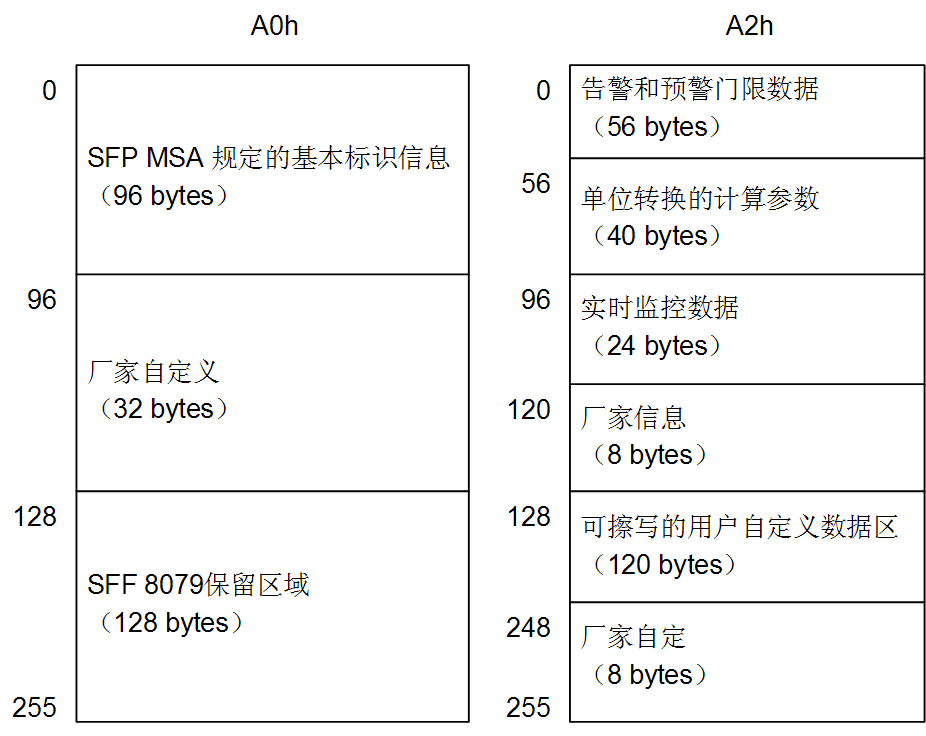

结构
====

本章主要包括如下内容：

-   内部结构

-   引脚定义

-   外形尺寸

    1.  内部结构

RSP光模块的内部结构如图4-1所示。

1.  RSP光模块内部结构

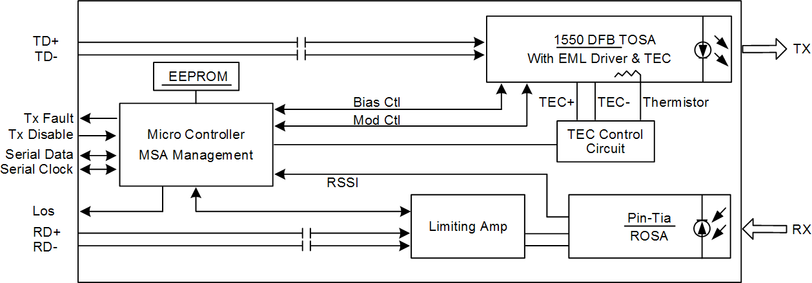

引脚定义
--------

RSP光模块的引脚分布如图4-2和表4-1所示。

1.  RSP光模块引脚分布

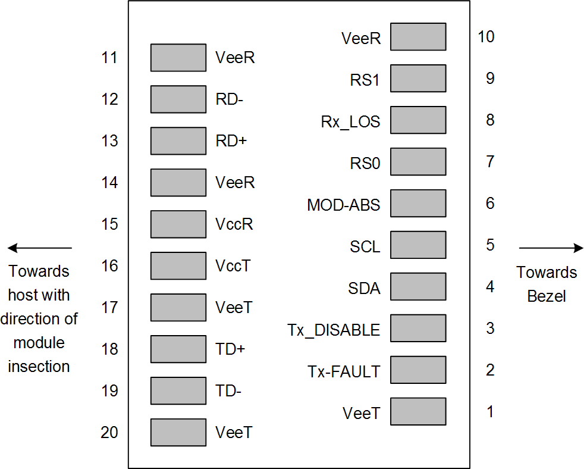

1.  RSP光模块引脚分布

| 引脚 | 符号      | 逻辑接口  | 描述                       | 备注  |
|------|-----------|-----------|----------------------------|-------|
| 1    | VEET      | \-        | 发送侧电源地               | 备注1 |
| 2    | Tx\_FAULT | LVTTL-O   | 激光器发送失效             | \-    |
| 3    | Tx\_DIS   | LVTTL-I   | 激光器关断功能             | 备注2 |
| 4    | SDA       | LVTTL-I/O | 2线串行接口数据线          | \-    |
| 5    | SCL       | LVTTL-I/O | 2线串行接口时钟线          | \-    |
| 6    | MOD-ABS   | \-        | 模块地，高电平表示模块丢失 | \-    |
| 7    | RS0       | LVTTL-I   | 接收侧速率选择0            | 备注3 |
| 8    | Rx\_LOS   | LVTTL-O   | 接收侧信号丢失告警         | \-    |
| 9    | RS1       | LVTTL-I   | 接收侧速率选择1            | 备注3 |
| 10   | VEER      | \-        | 接收侧电源地               | 备注1 |
| 11   | VEER      | \-        | 接收侧电源地               | 备注1 |
| 12   | RD-       | CML-O     | 接收数据输出（负）         | \-    |
| 13   | RD+       | CML-O     | 接收数据输出（正）         | \-    |
| 14   | VEER      | \-        | 接收侧电源地               | 备注1 |
| 15   | VCCR      | \-        | 接收侧3.3V电源引脚         | \-    |
| 16   | VCCT      | \-        | 发送侧3.3V电源引脚         | \-    |
| 17   | VEET      | \-        | 发送侧电源地               | 备注1 |
| 18   | TD+       | CML-I     | 待发送数据（正）           | \-    |
| 19   | TD-       | CML-I     | 待发送数据（负）           | \-    |
| 20   | VEET      | \-        | 发送侧电源地               | 备注1 |

-   低电平：激光器未关断，正常工作。

-   高电平：激光器关断，停止工作。

-   低电平：正常。

-   高电平：产生告警。

-   备注1：VCCR与VCCT应该与模块外壳隔离。

-   备注2：Tx-Disable 电平接口信号线需要外界4.7k～10k的上拉电阻。

-   备注3：速率选择定义请参考SFF-8431协议标准。

    1.  外形尺寸

瑞斯康达公司的RSP光模块结构符合SFP MSA要求，详情请参见SFF-8074i（SFP MSA）。

1.  RSP光模块外形尺寸

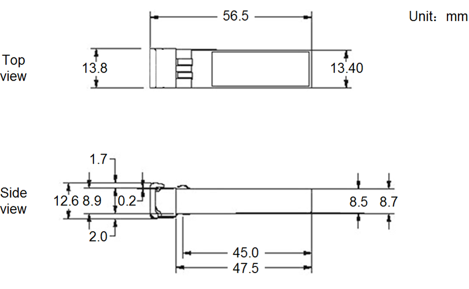

安装与拆卸
==========

本章主要包括如下内容：

-   安装

-   拆卸

    1.  安装

-   在安装RSP光模块时应采取防静电措施，避免损坏RSP光模块。

-   在将光纤跳线插入RSP光模块接口前应清洁光纤端面，以保持RSP光模块接口清洁，否则将影响RSP光模块性能。

-   RSP光模块接收侧的接收光功率过高可能导致RSP光模块损坏。

请按如下步骤安装RSP光模块：

1.  将RSP光模块平稳推入导轨，如图5-1所示。

    1.  将RSP光模块平稳推入导轨

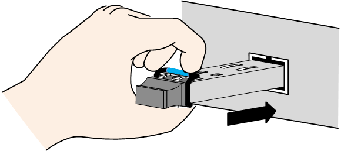

1.  轻轻按压RSP光模块使其与导轨锁紧，如图5-2所示。

    1.  轻轻按压RSP光模块

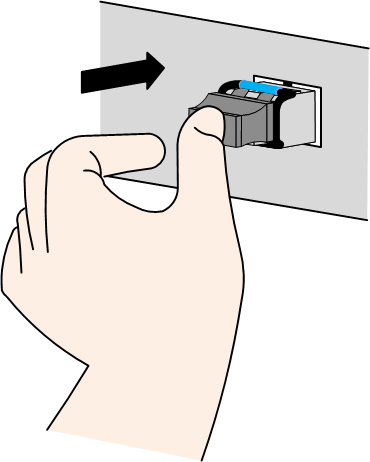

1.  向外侧轻拔RSP光模块，以确认RSP光模块与连接器已正常连接，如图5-3所示。

    1.  向外侧轻拔RSP光模块

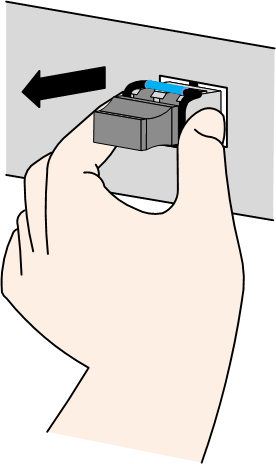

拆卸
----

-   在拆卸RSP光模块时应采取防静电措施，避免损坏RSP光模块。

-   在拆卸RSP光模块时，请严格按照如下所述方法进行，错误的拆卸方法（如未解除模块与导轨的锁紧状态而强行拆卸模块）可能导致模块或连接器永久损坏。

请按如下步骤拆卸RSP光模块：

1.  拆除RSP光模块上的光纤，如图5-4所示。

    1.  拆除RSP光模块上的光纤

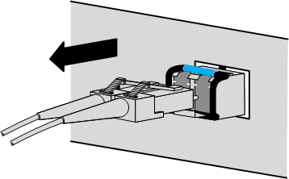

1.  轻轻按压RSP光模块，使其归位，如图5-5所示。

    1.  轻轻按压RSP光模块

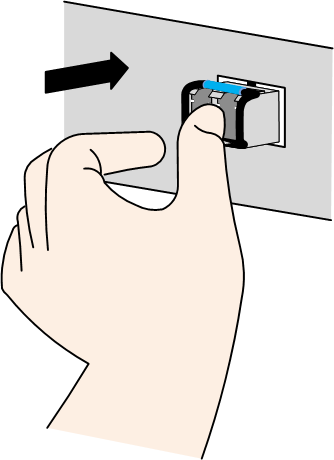

1.  将RSP光模块拉环轻轻向外侧弯折约90°，以解除模块与导轨的锁紧状态，如图5-6所示。

    1.  向外侧弯折RSP光模块拉环

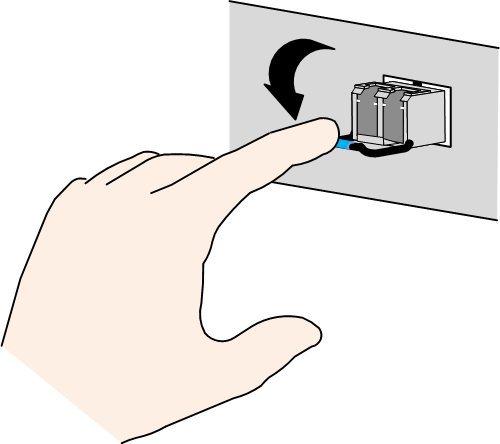

1.  保持RSP光模块拉环角度不变，将RSP光模块平稳地从导轨中抽出，如图5-7所示。

    1.  抽出RSP光模块

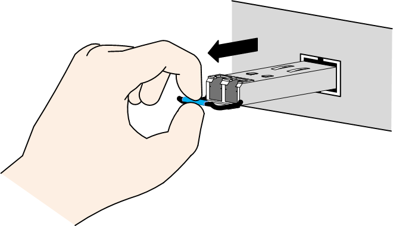

常见故障
========

本章主要介绍在使用RSP光模块时常见的故障及相应的解决方法，如表6-1所示。

1.  常见故障及解决方法

| 序号 | 故障现象                                                      | 解决方法                                                                                     |
|------|---------------------------------------------------------------|----------------------------------------------------------------------------------------------|
| 1    | RSP光模块接通业务光信号后LOS灯亮（或LNK灯灭）                 | 检查RSP光模块光口的清洁情况。                                                                |
| 2    | RSP光模块上电后，没有光功率输出                               | 检查RSP光模块光口的清洁情况。                                                                |
| 3    | 数字诊断数据超出正常范围，有警告提示                          | 若频繁出现温度告警，建议改善散热环境。                                                       |
| 4    | 数字诊断发送/接收光功率正常，实测光功率异常                   | 检查RSP光模块光口的清洁情况。                                                                |
| 5    | RSP光模块上电后LOL指示灯亮                                    | 检查RSP接收侧是否已接通业务光信号，如未接通，则光模块本身LOS告警阈值设置过低，请更换光模块。 |
| 6    | RSP光模块上电后，发送光功率正常，但无法与对端设备进行正常通信 | 检查光模块接收侧是否能正常工作。                                                             |

-   确认已接入的光信号速率与RSP光模块匹配。

-   确认设备配置的SFP接口速率与RSP光模块匹配。

-   检查相应光接口的接收光功率是否超过最小过载点或小于接收灵敏度，接收光功率超过最小过载点可能导致RSP光模块损坏，接收光功率小于接收灵敏度可能导致设备无法注册。若为单纤RSP光模块，则检查两端RSP光模块的波长、速率等是否匹配。

-   检查光纤跳线端面是否被污染或损坏。

-   检查光模块是否损坏。

-   检查设备是否使能了故障转移、激光器自动关断等可能导致激光器关闭的功能。

-   查看设备是否关闭了光口发送侧激光器。

-   若存在Tx\_fault告警，可能是运行条件恶劣或光模块故障。

-   电流电压告警与设备运行状态有关。

-   发送光功率告警可能导致Tx\_fault，建议更换光模块。

-   接收光功率低告警的原因可能是接收侧光功率过低或光模块已损坏，建议更换光模块；接收光功率过高告警建议增加光衰减器。

-   检查光纤跳线端面是否被污染。

-   光功率计精度是否正常。

-   RSP接通业务光信号后，仍存在此问题，请检查设备对端口的速率配置是否正确。

-   尝试重新插拔光模块或重启设备。

-   检查对端设备是否正确配置。

-   检查设备厂商是否对RSP光模块有特殊的定制化需求。

-   检查设备指示灯。

RSP光模块的接收光功率超出正常范围是导致链路故障的重要原因，因此在解决链路故障时可优先检查RSP光模块的接收光功率是否正常。各RSP光模块的接收光功率范围请参见“2
技术参数”。

附录
====

本章主要包括如下内容：

-   术语

-   缩略语

    1.  术语

| **G**          |                                                                                                                                                                                                           |
|----------------|-----------------------------------------------------------------------------------------------------------------------------------------------------------------------------------------------------------|
| 光功率         | 光在单位时间内所做的功。光功率的单位是毫瓦（mW）和分贝毫瓦（dBm），mW为线性单位，dBm为对数单位，二者的关系如下面公式所示。 P(dBm)=10Log(P(mW)/1mW)                                                        |
| 光纤           | 由电介质材料制成的细丝状的光波导，用以引导光波形式的电磁能量。                                                                                                                                            |
|                |                                                                                                                                                                                                           |
| **I**          |                                                                                                                                                                                                           |
| I2C            | 由PHILIPS公司开发的两线式串行总线，用于连接微控制器及其外围设备。是微电子通信控制领域广泛采用的一种总线标准。它是同步通信的一种特殊形式，具有接口线少，控制方式简单，器件封装形式小，通信速率较高等优点。 |
|                |                                                                                                                                                                                                           |
| **J**          |                                                                                                                                                                                                           |
| 激光器         | 利用外能维持粒子数反转，在光谐振腔中提供正反馈，通过受激发射并放大而产生相干光辐射的一种器件。                                                                                                            |
| 激光器自动关断 | 当光接口的光纤被拔出或光发射器的输出功率过大时，光接口自动关断激光器，防止出现维护或运行风险。                                                                                                            |
| 接收灵敏度     | 在满负荷数据流量下，光纤收发器丢帧率为零时，光接收器可以接收的最小平均输入光功率。                                                                                                                        |
|                |                                                                                                                                                                                                           |
| **X**          |                                                                                                                                                                                                           |
| 消光比         | 假设规定： A表示高电平时平均输出光功率； B表示低电平时平均输出光功率。 消光比是在最坏反射条件时，光发送器在全调制条件下A与B比值的最小值，即 消光比ER=10lg(A/B)                                            |
|                |                                                                                                                                                                                                           |
| **Y**          |                                                                                                                                                                                                           |
| 眼图           | 二进制或多进制信号经传输后，在示波器上所显示的连续重叠波形类似于人的眼睛。一般称作眼图。通过它能看出码间干扰的程度，眼睛张得大，表明失真小；反之失真大。                                                  |

缩略语
------

| **A**  |                                                                                                   |                                                |
|--------|---------------------------------------------------------------------------------------------------|------------------------------------------------|
| APD    | Avalanche Photo Diode                                                                             | 雪崩光电二极管                                 |
|        |                                                                                                   |                                                |
| **B**  |                                                                                                   |                                                |
| BER    | Bit Error Rate                                                                                    | 误码率                                         |
| BOL    | Beginning of Life                                                                                 | 寿命初始                                       |
|        |                                                                                                   |                                                |
| **C**  |                                                                                                   |                                                |
| CWDM   | Coarse Wavelength Division Multiplexing                                                           | 稀疏波分复用                                   |
|        |                                                                                                   |                                                |
| **D**  |                                                                                                   |                                                |
| DDMI   | Digital Diagnostic Monitor Interface                                                              | 数字诊断接口                                   |
| DFB    | Distributed Feedback                                                                              | 分布反馈                                       |
| DWDM   | Dense Wavelength Division Multiplexing                                                            | 密集波分复用                                   |
|        |                                                                                                   |                                                |
| **E**  |                                                                                                   |                                                |
| EEPROM | Electrically Erasable Programmable Read-Only Memory                                               | 电可擦写可编程只读存储器                       |
| EMI    | Electromagnetic Interference                                                                      | 电磁干扰                                       |
| EOL    | End of Life                                                                                       | 寿命终了                                       |
|        |                                                                                                   |                                                |
| **I**  |                                                                                                   |                                                |
| IEEE   | Institute of Electrical and Electronics Engineers                                                 | 电气和电子工程师协会                           |
| ITU-T  | International Telecommunications Union-Telecommunication Standardization Sector                   | 国际电信联盟远程通信标准化组织                 |
|        |                                                                                                   |                                                |
| **L**  |                                                                                                   |                                                |
| LC     | Little Connector                                                                                  | 小型连接器                                     |
| LOS    | Loss of Signal                                                                                    | 信号丢失                                       |
|        |                                                                                                   |                                                |
| **M**  |                                                                                                   |                                                |
| MM     | Multi-Mode                                                                                        | 多模                                           |
| MSA    | Multi Source Agreement                                                                            | 多源协议                                       |
|        |                                                                                                   |                                                |
| **P**  |                                                                                                   |                                                |
| PIN    | P type-intrinsic-n type                                                                           | PIN光电二极管                                  |
|        |                                                                                                   |                                                |
| **R**  |                                                                                                   |                                                |
| RMS    | Root Mean Square                                                                                  | 均方根                                         |
| RoHS   | The Restriction of the Use of Certain Hazardous Substances in Electrical and Electronic Equipment | 关于在电气电子设备中限制使用某些有害物质的指令 |
|        |                                                                                                   |                                                |
| **S**  |                                                                                                   |                                                |
| SCL    | Serial Clock                                                                                      | 串行时钟                                       |
| SDA    | Serial Data Line                                                                                  | 串行数据线                                     |
| SDH    | Synchronous Digital Hierarchy                                                                     | 同步数字系列                                   |
| SFP    | Small Form-factor Pluggable                                                                       | 小封装可插拔                                   |
| SM     | Single-Mode                                                                                       | 单模                                           |
|        |                                                                                                   |                                                |
| **T**  |                                                                                                   |                                                |
| TTL    | Transistor-Transistor Logic                                                                       | 晶体管-晶体管逻辑电平                          |

